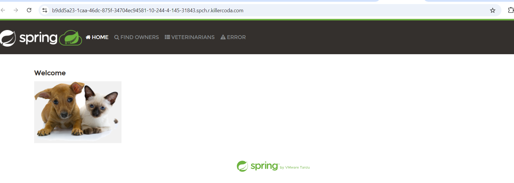
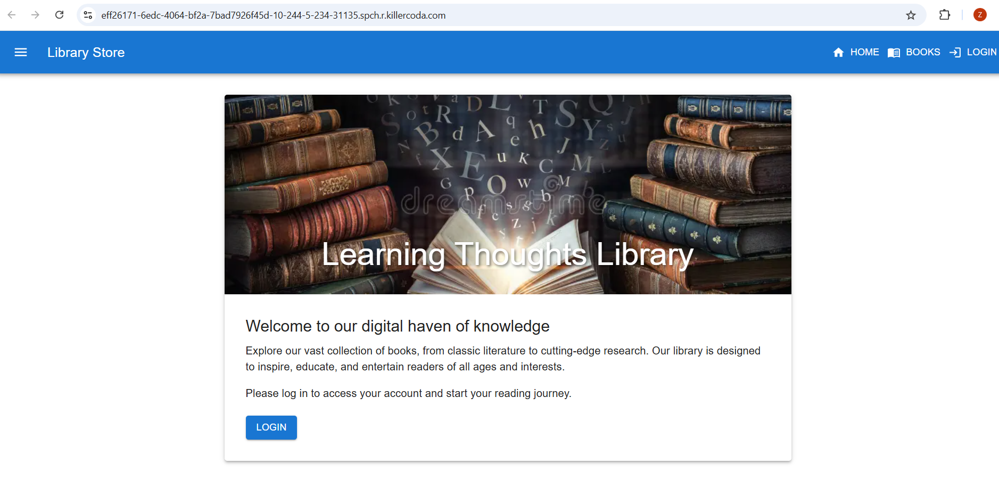
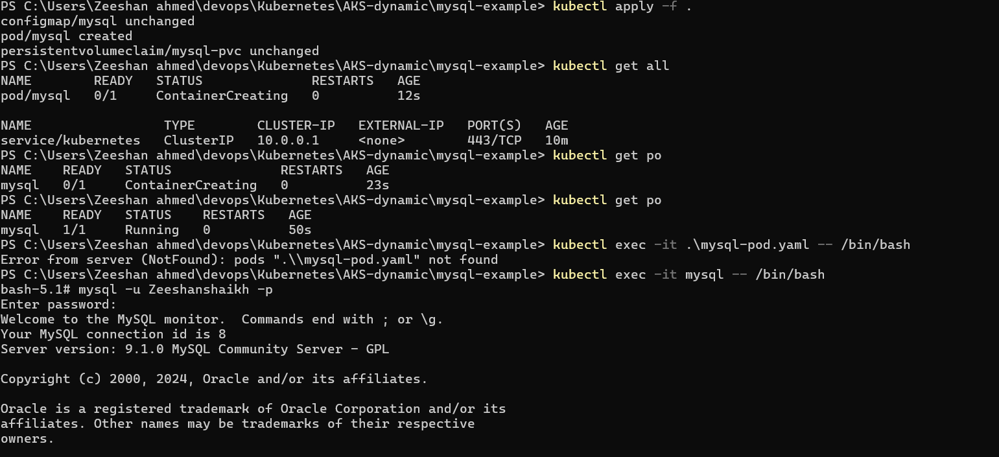
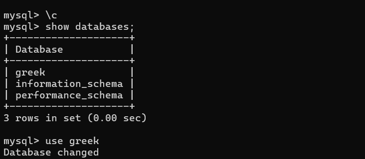
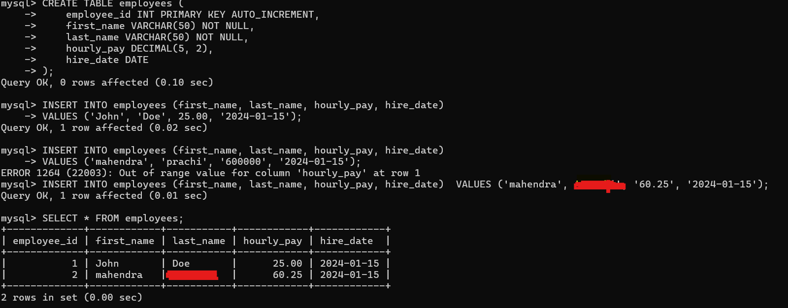

# NOTES: "Kubernetes"

### K8s Crashloopbackoff

* A CrashLoopBackOff is a common error in Kubernetes that indicates a container within a Pod is repeatedly crashing and restarting. This state arises when the container fails to start properly, leading Kubernetes to implement an exponential back-off strategy, where it increases the wait time between restart attempts. This delay starts at 10 seconds and can extend up to five minutes if the container continues to fail.

### Init containers  

* Init containers in Kubernetes are specialized containers that run before the main application containers within a Pod. Their primary purpose is to perform initialization tasks, ensuring that any necessary setup or configuration is completed before the application begins executing.
* Its like depends on statement.

* After writing a yaml file for running any application in K8s,
  * Exposing Pod directly to external world is not a recommended practice, we are using the following only for evaluation.

### Resources in Pods

* Resources refer to the computing power and memory that containers require to function effectively within a cluster
* It limits the memory which requires to run in  the pods
  * CPU
  * RAM  
* It is of are two types
  * requests # lower limits
  * limits # Upper limits

### Replica Sets

* ReplicaSets are a vital component for managing the availability and scaling of applications within a Kubernetes cluster.

### Purpose of Replica sets

* Maintain Desired State: A ReplicaSet ensures that a specified number of identical Pods are running at all times. If any Pod fails or is terminated, the ReplicaSet automatically creates new Pods to replace them, maintaining the desired count.
* Load Balancing: With multiple Pods running, incoming traffic can be distributed among them, preventing any single Pod from becoming overwhelmed.
* Scaling: ReplicaSets allow for easy scaling of applications. You can increase or decrease the number of replicas based on demand using simple commands, enabling dynamic resource management. It enhances the self-healing which monitor the ReplicaSets.
* Integration with Deployments: While you can create ReplicaSets directly, they are often managed through Deployments, which provide additional features like rolling updates and rollback capabilities, making application management more straightforward

### Service

* Kubernetes Services are crucial for ensuring reliable communication, load balancing, and accessibility of applications within a cluster, making them foundational for building scalable and resilient microservices architectures.
* It usually exposes all these
  * ClusterIP: Exposes the Service on a cluster-internal IP, allowing communication between Pods.
  * NodePort: Exposes the Service on each Node’s IP at a static port, enabling external access.
  * LoadBalancer: Creates an external load balancer in supported cloud environments to distribute traffic to the Service

* Therefore code is present in the my repo, following image shows the Service application has worked successfully,
 

### Rolling Updates

* Rolling updates are a deployment strategy in Kubernetes that allows for the gradual replacement of Pods running an application with new versions, ensuring continuous availability and minimal downtime.

### Deployments

### Annotations

### Config-Maps

### Secret keys

### Health Checks/Probes

* Kubernetes health checks are essential for maintaining application stability and performance by providing early detection of issues, ensuring only ready instances serve traffic, and optimizing resource management within the cluster.
* There are three types of Probes
  * Liveness Probes: These determine if a container is running. If a liveness probe fails, Kubernetes will restart the container.
  * Readiness Probes: These check if a container is ready to handle requests. If a readiness probe fails, Kubernetes will stop sending traffic to that container until it is ready again.
  * Startup Probes: These are used to check if an application has started successfully, allowing for longer initialization times without affecting the overall health checks.
* It basically, ensures that only healthy instances serve traffic.

### Daemon Sets

* DaemonSets are a specialized type of workload controller that ensure a specific Pod runs on all or selected nodes within a cluster.
* This feature is particularly useful for deploying background services that need to operate on every node, such as monitoring agents, logging services, or network proxies.
* **Example**: Imagine you have a team of workers (nodes) in an office (cluster). A DaemonSet is like assigning a task (running a Pod) to each worker so that they all do it at the same time. If you hire a new worker, they automatically get assigned the same task without you having to tell them.

### CronJobs

* Kubernetes CronJobs provide an efficient way to manage scheduled tasks in a containerized environment, making them essential for automating routine operations within your applications.
  * **Example**: Imagine you have a task to send out a report every day at 8 AM. Instead of remembering to do it yourself, you set up a CronJob that automatically sends the report at that time every day.

### Namespaces

### Kubernetes Storage

* What is a Persistent Volume (PV)?
  * A Persistent Volume (PV) is like a storage unit in your Kubernetes environment. It represents a piece of storage that has been set up and is available for use, such as a disk or file system.
* What is a Persistent Volume Claim (PVC)?
  * A Persistent Volume Claim (PVC) is a request made by a user or application for a specific amount of storage from the available PVs. Think of it as saying, "I need this much space to store my data."
* How do they work together?
  * When an application needs storage, it creates a PVC specifying how much space it needs and how it wants to access that storage (like read/write permissions). Kubernetes then looks for an available PV that meets these requirements and binds the PVC to that PV.
  * This binding means that the application can now use the storage defined in the PV through its PVC, ensuring that even if the application restarts or fails, it can still access its data.
* It willbe running on AKS cluster or EBS or on-prem, etc..
* After writing the yaml file, while executing the file we can store our data using, "mysql databse"
* 
* 
* 
