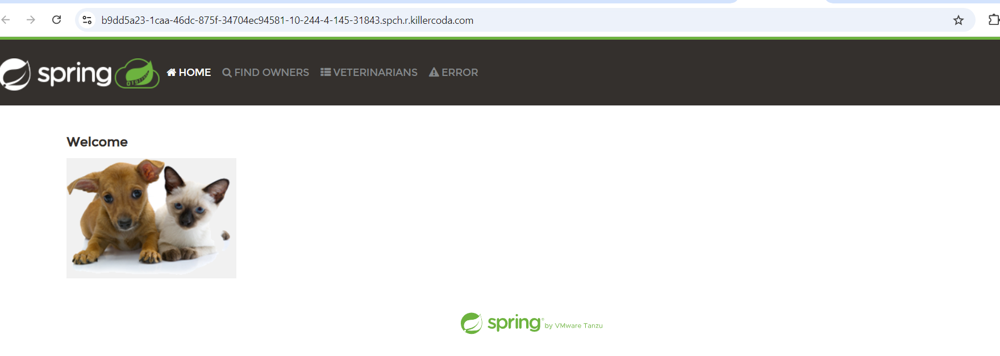

### K8s Crashloopbackoff 

* A CrashLoopBackOff is a common error in Kubernetes that indicates a container within a Pod is repeatedly crashing and restarting. This state arises when the container fails to start properly, leading Kubernetes to implement an exponential back-off strategy, where it increases the wait time between restart attempts. This delay starts at 10 seconds and can extend up to five minutes if the container continues to fail.

#### Init containers  

* Init containers in Kubernetes are specialized containers that run before the main application containers within a Pod. Their primary purpose is to perform initialization tasks, ensuring that any necessary setup or configuration is completed before the application begins executing. 
* Its like depends on statement.

* After writing a yaml file for running any application in K8s, 
     * Exposing Pod directly to external world is not a recommended practice, we are using the following only for evaluation.

##### Resources in Pods
* Resources refer to the computing power and memory that containers require to function effectively within a cluster
* It limits the memory which requires to run in  the pods
    * CPU 
    * RAM  
* It is of are two types 
  * requests # lower limits
  * limits # Upper limits 

###### Replica Sets
* ReplicaSets are a vital component for managing the availability and scaling of applications within a Kubernetes cluster. 
## Purpose of Replica sets:
 * Maintain Desired State: A ReplicaSet ensures that a specified number of identical Pods are running at all times. If any Pod fails or is terminated, the ReplicaSet automatically creates new Pods to replace them, maintaining the desired count.
 * Load Balancing: With multiple Pods running, incoming traffic can be distributed among them, preventing any single Pod from becoming overwhelmed.
 * Scaling: ReplicaSets allow for easy scaling of applications. You can increase or decrease the number of replicas based on demand using simple commands, enabling dynamic resource management. It enhances the self-healing which monitor the ReplicaSets.
 * Integration with Deployments: While you can create ReplicaSets directly, they are often managed through Deployments, which provide additional features like rolling updates and rollback capabilities, making application management more straightforward

###### Service 
* Kubernetes Services are crucial for ensuring reliable communication, load balancing, and accessibility of applications within a cluster, making them foundational for building scalable and resilient microservices architectures.
* It usually exposes all these 
    * ClusterIP: Exposes the Service on a cluster-internal IP, allowing communication between Pods.
    * NodePort: Exposes the Service on each Node’s IP at a static port, enabling external access.
    * LoadBalancer: Creates an external load balancer in supported cloud environments to distribute traffic to the Service

* Therefore code is present in the my repo, following image shows the Service application has worked successfully,                       
   

